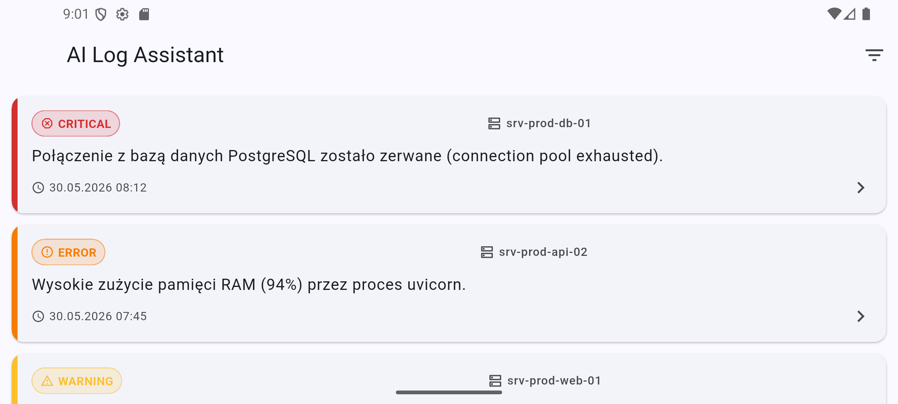
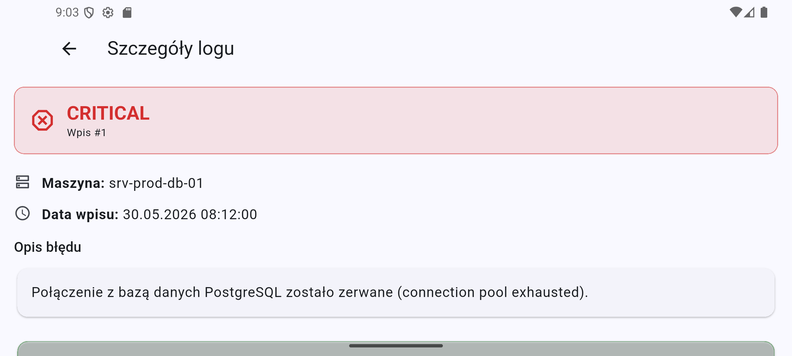

# AI Log Assistant

Aplikacja mobilna do monitorowania logów systemowych z analizą AI, stworzona dla
fikcyjnej firmy **CyberTech Solutions**. Projekt powstał jako praca inżynierska
i składa się z dwóch komponentów:

- **`log_assistant/`** — aplikacja mobilna (Flutter, Material Design 3)
- **`backend/`** — serwer API (FastAPI) dostarczający logi wraz z diagnozą AI

Administrator IT przegląda logi z serwerów produkcyjnych, filtruje je po poziomie
ważności i dla każdego wpisu otrzymuje gotową rekomendację wygenerowaną przez AI.

---

## Architektura

```
┌─────────────────────────┐         HTTP / JSON          ┌──────────────────────┐
│   Aplikacja Flutter     │  ───────────────────────────▶│   Backend FastAPI    │
│   (log_assistant/)      │   GET /logs                  │   (backend/)         │
│                         │   GET /logs/{id}             │                      │
│   • Material Design 3   │◀───────────────────────────  │   • Modele Pydantic  │
│   • Lista + filtrowanie │         lista / wpis          │   • Dane przykładowe │
│   • Szczegóły + AI      │                              │   • Filtrowanie      │
└─────────────────────────┘                              └──────────────────────┘
```

Aplikacja jest klientem REST — całą logikę danych (sortowanie, filtrowanie) realizuje
backend, dzięki czemu warstwa mobilna pozostaje cienka i łatwa w utrzymaniu.

---

## Funkcje

- 📋 **Lista logów** z kolorowym oznaczeniem poziomu ważności
  (🔴 CRITICAL, 🟠 ERROR, 🟡 WARNING, 🔵 INFO)
- 🔍 **Filtrowanie** po poziomie ważności
- ↻ **Pull-to-refresh** — odświeżanie listy gestem
- 🤖 **Ekran szczegółów** z diagnozą AI w wyróżnionej, zielonej karcie
- 🌐 **Obsługa błędów sieciowych** — czytelne komunikaty i przycisk ponowienia
- 🌗 **Motyw jasny i ciemny** (Material 3, dynamiczny kolor bazowy)

---

## Struktura projektu

```
AI-Log-Assistant/
├── README.md                  # ten plik
├── log_assistant/             # aplikacja Flutter
│   └── lib/
│       ├── main.dart          # punkt wejścia, motyw, wstrzyknięcie ApiService
│       ├── models/            # LogEntry + enum PoziomWaznosci
│       ├── services/          # ApiService — komunikacja z backendem
│       ├── screens/           # ekrany: lista, szczegóły
│       └── widgets/           # LogCard — karta logu
├── backend/                   # serwer FastAPI
│   ├── main.py                # aplikacja i endpointy
│   ├── models.py              # modele Pydantic
│   ├── sample_data.py         # przykładowe logi (w pamięci)
│   ├── requirements.txt       # zależności Pythona
│   └── README.md              # szczegóły backendu
└── screenshot_*.png           # zrzuty ekranu z emulatora
```

---

## Wymagania

| Narzędzie | Wersja (testowana) |
|---|---|
| Flutter SDK | 3.41.8 (Dart 3.11.5) |
| Python | 3.13 (3.11+) |
| Android SDK / emulator | API 36 (Android 16) lub urządzenie fizyczne |

---

## Uruchomienie

Aplikacja wymaga **działającego backendu**. Uruchom oba komponenty.

### 1. Backend (FastAPI)

```powershell
cd backend
python -m venv .venv
.\.venv\Scripts\Activate.ps1          # Windows PowerShell
pip install -r requirements.txt
uvicorn main:app --reload --host 0.0.0.0 --port 8000
```

- Dokumentacja interaktywna (Swagger): http://localhost:8000/docs
- `--host 0.0.0.0` jest konieczne, aby emulator/urządzenie miało dostęp do serwera.

### 2. Aplikacja (Flutter)

```powershell
cd log_assistant
flutter pub get
flutter run
```

---

## Konfiguracja adresu API

Domyślny adres backendu to `http://10.0.2.2:8000` (localhost hosta widziany z emulatora
Androida). W zależności od środowiska:

| Środowisko | Adres API |
|---|---|
| Emulator Android | `http://10.0.2.2:8000` (domyślny) |
| Symulator iOS | `http://localhost:8000` |
| Urządzenie fizyczne | `http://<IP-komputera>:8000` (ta sama sieć Wi-Fi) |

Adres można nadpisać bez zmiany kodu:

```powershell
flutter run --dart-define=API_BASE_URL=http://192.168.0.10:8000
```

---

## API

| Metoda | Ścieżka | Opis |
|---|---|---|
| `GET` | `/` | Health-check |
| `GET` | `/logs` | Lista logów. Filtr: `?poziom_waznosci=CRITICAL` |
| `GET` | `/logs/{id}` | Szczegóły wpisu (404, gdy brak) |

Pełny opis kontraktu znajduje się w [`backend/README.md`](backend/README.md).

### Model danych (`LogEntry`)

| Pole (JSON) | Typ | Opis |
|---|---|---|
| `id` | int | Identyfikator wpisu |
| `maszyna_nazwa` | string | Nazwa serwera/maszyny |
| `opis_bledu` | string | Opis zdarzenia / błędu |
| `rekomendacja_ai` | string | Diagnoza i rekomendacja AI |
| `poziom_waznosci` | string | `INFO` \| `WARNING` \| `ERROR` \| `CRITICAL` |
| `data_wpisu` | string | Data ISO 8601 (UTC) |

---

## Testy

```powershell
cd log_assistant
flutter analyze        # analiza statyczna
flutter test           # testy widgetów
```

---

## Zrzuty ekranu

| Lista logów | Szczegóły + diagnoza AI |
|---|---|
|  |  |

---

## Uwagi

- Dane logów są przechowywane **w pamięci** (`backend/sample_data.py`). W docelowym
  wdrożeniu należałoby podpiąć bazę danych (np. PostgreSQL + SQLAlchemy).
- CORS w backendzie jest otwarty (`*`) — wygodne na czas developmentu; przed produkcją
  należy zawęzić listę dozwolonych źródeł.

---

_Projekt edukacyjny (praca inżynierska) — CyberTech Solutions._
